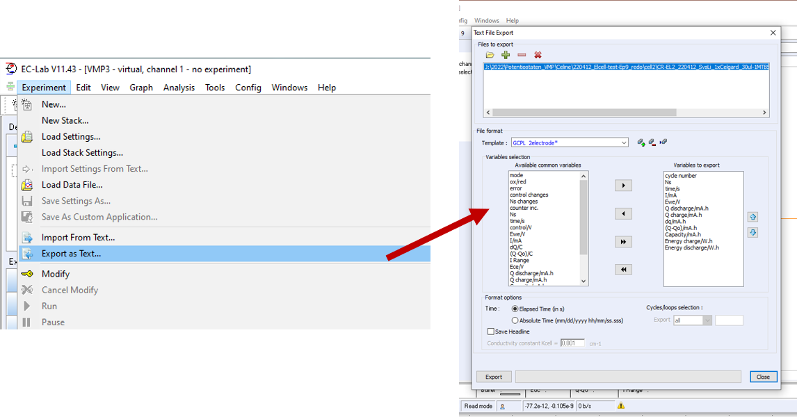

<!-- README.md is generated from README.Rmd. Please edit that file -->

# bat2dat

<!-- badges: start -->
<!-- badges: end -->

This package was developed to facilitate the data processing and
analysis of experimental battery data from potentiostats. Each
potentiostat manufacturer uses his own file formats that are only
readable in customized software. Usually an export into .txt, .csv or
.xlsx files is possible. The structure of each of these files, including
the way the data is reported, can differ considerably between different
manufacturer. This tools aims to convert various potentiostat outputs
into a uniform structure while extracting key parameters and datasets
for further graphical processing (e.g. in Origin). In addition, a html
report can be created that offers an option to quickly access certain
information. The package is deliberately designed in a modular manner,
so that other potentiostats can be easly integrated into the existing
structure. For this tool to work metadata has to be provided.

## Installation

bat2dat is based on R programming language. To install R and the
functions of bat2dat on your computer follow these three steps:  
1) Install the **latest R version**. You’ll find the latest version on
the following website

> <https://www.r-project.org/>  
> <https://ftp.fau.de/cran/>

2)  install required Rpackages used within bat2dat. To do so copy the
    following lines into your R console. If the code is not run
    automatically press *Enter*

``` r
#utils: basic functions
install.packages('utils')   

#magrittr: piping operators
install.packages('magrittr')

#dplyr: modify data through filter, select and mutate
install.packages('dplyr')

#tidyr: modify data.frames
install.packages('tidyverse')

#zoo: for moving average on data
install.packages('zoo')

#readxl: open excel files
install.packages('readxl')

#ggplot2: plot data
install.packages('ggplot2')

#gridExtra: combine plots generated with ggplot2
install.packages('gridExtra')

#viridis: colour spectrum
install.packages('viridis')

#rmarkdown: generates html or pdf files / reports
install.packages('rmarkdown')

#optparse: interface for Linux subsystem
install.packages("optparse")

#RODBC: open microsoft access files
install.packages('RODBC')

#knitr: knitr package to generate reports
install.packages('knitr')

#kableExtra: additional package to knitr & Rmarkdown
install.packages('kableExtra')
```

A more user-friendly environment is provided by RStudio, which can be
downloaded as free desktop version from here: \>
<https://www.rstudio.com/products/rstudio/download/#download>  

Note: in RStudio R is executed by marking the code snippet you’d like to
run and press **ctrl + enter** (*Windows*) or **cmd + enter**
(*MacOS*).  

3)  You can install the development version of bat2dat via GitHub like
    so:  

``` r
devtools::install_github('fabje223/bat2dat')
```

> the command might cause an error, if you are connected to a company
> network.  
> outside restricted networks, the installation should proceed without
> problems.  

To update to the latest version of *bat2dat* repeat step 3) once in a
while.

## Requirements

The main idea of bat2dat is to provide an easy way to convert data from
battery cyclers into a standardized format for further processing.  
bat2dat requires a curated data folder containing:  
- experimental data (.txt, .xlsx, … etc.) –\> the format depends on the
battery cycler used  
- a metadata file *‘meta.csv’* meta.csv requires the following general
structure:  

| Identifier | sample.name |  instrument  |  cell.config   | AM.loading |
|:----------:|:-----------:|:------------:|:--------------:|:----------:|
|  Sample 1  | experiment1 | Biologic BCS | halfcell-anode |    1.00    |

### **Notes -1-: bat2dat specific *meta.csv* syntax** 

-   in case meta.csv is created manually:

> *Identifier*, *sample.name*, *instrument* and *cell.config* are text
> or character items and need to be put in quotation marks, e.g. “sample
> 1”  
> items in meta.csv are separated by a tab separator  

-   *instrument*:

> *Biologic BCS* refers to BCS instrument by Biologic (.txt format,
> exported from ECLab)  
> *Biologic VMP* refers to VMP/VSP instruments by Biologic (.txt format,
> exported from ECLab)  
> *Arbin* refers to Arbin battery cyclers (.res format or exported via
> Excel Plug-In as .xlsx)  

bat2dat has a modular approach and more cyclers can be added if
needed.  

-   *cell.config* has to be defined for some of the scripts in order to
    split up charge and discharge sequences correctly:

> *halfcell-anode* (cycling starts with a negative current)  
> *halfcell-cathode* & *fullcell* (the two are equivalent; cycling
> starts with a positive current)  
> *LiS* is an except, as it is cell-specific: sulfur batteries, though a
> cathode, are techniqually in a charged state and thus start with a
> negative current.  

-   *AM.loading*: the active material mass should be given in units of
    \[mg\]

### **Notes -2-: bat2dat specific *meta.csv* syntax** 

*meta.csv* can be created from digital lab notebooks.  
A POLiS and Kadi4Mat compatible notebook is provided in the */data-raw
folder* (*labnotes_example.xlsx*).  
The *meta.csv* file can be generated using the
***CellLog-xlsx-to-csv.R*** script.  
Other notebook imports can be created upon request.

``` r
data(exampleMeta)
knitr::kable(head(exampleMeta, 2), 
             align = 'c',
             caption = "Table: Structure of meta.csv file")
```

| Identifier |       sample name        |  instrument  |  cell config   | AM loading |
|:----------:|:------------------------:|:------------:|:--------------:|:----------:|
|  sample1   | SampleExample_Biologic-1 | Biologic BCS | halfcell-anode |   7.7995   |
|  sample2   | SampleExample_Biologic-2 | Biologic BCS | halfcell-anode |   7.5525   |

Table: Structure of meta.csv file

## Supported datasets

### Biologic Data

Biologic instruments save acquired data in a *.mpr* file (*EC-Lab raw
data binary file*), which is complex to read-in directly. Therefore, the
workaround herein is to **use export function of EC-Lab** (*Experiment
\> Export as Text…*).



The exported data table should look like this (may vary depending on the
exported variables):

``` r
data(exampleData)
knitr::kable(head(exampleData, 5), 
             align = 'c',
             caption = "Table: Structure of EC-Lab .txt files")
```

| cycle.number | Ns  | time.s | X.I..mA | Ecell.V  | Q.discharge.mA.h | Q.charge.mA.h | dq.mA.h | X.Q.Qo..mA.h | Capacity.mA.h | Energy.charge.W.h | Energy.discharge.W.h |  X  |
|:------------:|:---:|:------:|:-------:|:--------:|:----------------:|:-------------:|:-------:|:------------:|:-------------:|:-----------------:|:--------------------:|:---:|
|      0       |  0  |   0    |    0    | 2.153887 |        0         |       0       |    0    |      0       |       0       |         0         |          0           | NA  |
|      0       |  0  |  300   |    0    | 2.156328 |        0         |       0       |    0    |      0       |       0       |         0         |          0           | NA  |
|      0       |  0  |  600   |    0    | 2.158218 |        0         |       0       |    0    |      0       |       0       |         0         |          0           | NA  |
|      0       |  0  |  900   |    0    | 2.159084 |        0         |       0       |    0    |      0       |       0       |         0         |          0           | NA  |
|      0       |  0  |  1200  |    0    | 2.160541 |        0         |       0       |    0    |      0       |       0       |         0         |          0           | NA  |

Table: Structure of EC-Lab .txt files

The strange looking column names are a result of the import into R and
are renamed during the analysis. For the script to work, ***the
following parameters need to be exported***:

> cycle.number, time.s, Ns, Ecell.V, X.I..mA, Q.discharge.mA.h,
> Q.charge.mA.h

**Note**: Biologic BCS name the potential *Ecell.V*, whereas VMP/VSP/MPG
potentiostats call the same parameter *Ewe.V*. This is an important
distinction and the reason why *Biologic BCS* is a separate “instrument
parameter” in the *meta.csv* file.

### Arbin Data

Arbin data comes in 2 formats: it is saved by the instrument as a *.res*
file and can be converted via the Excel plug-in to a *.xlsx* result file
with several tabs for metadata. raw cycling data, (processed) Stats-Tab
for end-of-cycling-sequence information (e.g. cycle number
vs. capacity). Both types can be imported into R. Import of *.res* files
require the RODBC package (included in the package recommendations
above) and changing the file extension from .res to *.accdb* (Access
database file).

## How to use

**Experimental data and the metadata file need to be located in the same
folder on the local hard drive.**  
The analysis script is started by executing:

    #if library is not loaded already
    library(bat2dat)

    # generates a data report if htmlReport == TRUE
    # exports a .txt file if exportCap == TRUE
    report0r(   cccv = FALSE,                 #optional
                cycles = c(1,2,5,10,25,50),   #optional
                htmlReport = TRUE, 
                exportCap = TRUE)

During execution you will be asked for the directory of your
experimental data. Select the meta.csv file and execution will continue.
**It is important that meta.csv and raw data files are located in the
same folder**. Additional files do not interfere.

> the script offers four options:  
> - perform a CC-CV step analysis to separate constant current and
> constant potential contributions? yes(=TRUE)/no(=FALSE)  
> - which cycles would you like to extract to plot voltage profiles?  
> options: - use default (c(seq(0, 100, 10)), i.e. 0, 10, 20, 30,…, 100)
> Note that Biologic starts counting from 0.  
> - make your own selection, type: c(*cycle#x*, *cycle#y*, …,
> *cycle#xy*) or for a number range, e.g. c(1:100)  
> - generate a html-report? yes(=TRUE)/no(=FALSE)  
> - export analysed data as .txt file? yes(=TRUE)/no(=FALSE)  
>
> The default settings for the latter two is TRUE. The script won’t run
> the analysis if both values are set to FALSE (at least one has to be
> TRUE).  
> once the script started, you will be asked to specify the location of
> your data.  
> see also: Section Examples

If you’d like to work with your data in R afterwards, call report0r()
like this:  

    samples <- report0r( htmlReport = TRUE, 
                         exportCap = TRUE)

samples will be a list of all samples contained in the metadata file
(*meta.csv*) and contains up to three different analysed objects:

> *capacity*: end of cycling squence (e.g. charge & discharge capacity
> or Coulombic efficiency vs. cycle number) –\> format: R data.frame  
> *VoltageProfiles*: section of raw data for selected cycles –\> format:
> list of data.frames  
> *CCCV*: if galvanostatic cycling was performed in a constant current
> constant potential technqiue (CC-CV), a CCCV step analysis can be
> performed, splitting the contributions of the CC and CV step –\>
> format: R data.frame  

Exported data will be saved as a subfolder *Rprocessed* of the raw data
folder (*path/to/data/Rprocessed*) on your local hard drive.

## Functions

### report0r()

> Full analysis with .txt export and html report  
> All initial parameters of the report0r function have a default value,
> so that the script can be run with default settings, like so:

    #if library is not loaded already
    library(bat2dat)

    # generates a data report if htmlReport == TRUE
    # exports a .txt file if exportCap == TRUE
    report0r()

If you would like to change the cycles for the voltage profile
extraction run *report0r()* like this:

In this first example html report *and* .txt export will both be
executed):

    #if library is not loaded already
    library(bat2dat)

    # generates a data report if htmlReport == TRUE
    # exports a .txt file if exportCap == TRUE
    report0r(cycles = c(1,2,5,10,25,50))

In the second example only the .txt export is performed (same cycles are
extracted), i.e. put the function to FALSE you do not want included:

    #if library is not loaded already
    library(bat2dat)

    # generates a data report if htmlReport == TRUE
    # exports a .txt file if exportCap == TRUE
    report0r( cycles = c(1,2,5,10,25,50), 
              htmlReport = FALSE)

> **HINT** There are different ways to choose your cycles:  
> - manually: cylces = c(1,6,9,3,12,99) –\> no specific order needed,
> just type the numbers you’d like to extract  
> - intervall: cycles = c(seq(0, 99, 10)) –\> the first two numbers
> define the boundary (from 0 to 99); the third number defines the
> interval (every 10th cycle)  
> - mixed: cycles = c(0,1,2,4, seq(9,99,10)) –\> combine the two above.

### process0r()

> perform a data analysis and receive sample information in a R list
> object for further processing  

If you’d like to skip the export and report function all together call
process0r() directly (before report0r() did this job for us):  

    #if library is not loaded already
    library(bat2dat)

    # starts data analysis
    # default: cccv=FALSE & cycles(seq(0,100,10))
    process0r()

If you would like to make changes to the analysis, i.e. include a CC-CV
step analysis (cccv=TRUE) or change the cycle numbers in the voltage
profile extraction proceed like this:  

    #if library is not loaded already
    library(bat2dat)

    # starts data analysis
    # default: cccv=FALSE & cycles(seq(0,100,10))
    process0r(cccv=TRUE,
              cycles(1,2,5,10,25))

### metaDir()

> import a meta data file from a folder

To import a meta data table into R simple use:  

    #if library is not loaded already
    library(bat2dat)

    # starts data analysis
    meta <- metaDir()

### BCSraw(), VMPraw(), ARBINrawXLSX()

> import raw data files into R

The functions require 2 variables:  
- *directory* (dir), i.e. where is the file stored - *filename*, name of
the experimental data file (for BCSraw and VMPraw a .txt file; for
ARBINrawXLSX a .xlsx file)  

The two variables need to be either be defined prior, or be available in
a metadata file (–\> metaDir())  

    #if library is not loaded already
    library(bat2dat)

    # starts data analysis
    raw <- VMPraw(dir, filename)

If a metadata file was imported through metaDir(), use:  

    raw <- VMPraw(dir=meta$dir[1], 
                  filename= meta$sample.name[1])

*Note: the number in brackets \[x\] is the entry in the metadata file
(by row)*  

You could also type *filename* (without file extension, i.e. .txt, etc)
and *dir* manually. Or using the following code snippet:  

    #Pop-up window to select file path:
    fileDir <- file.choose()

    #defines dir
    dir <- dirname(fileDir)
